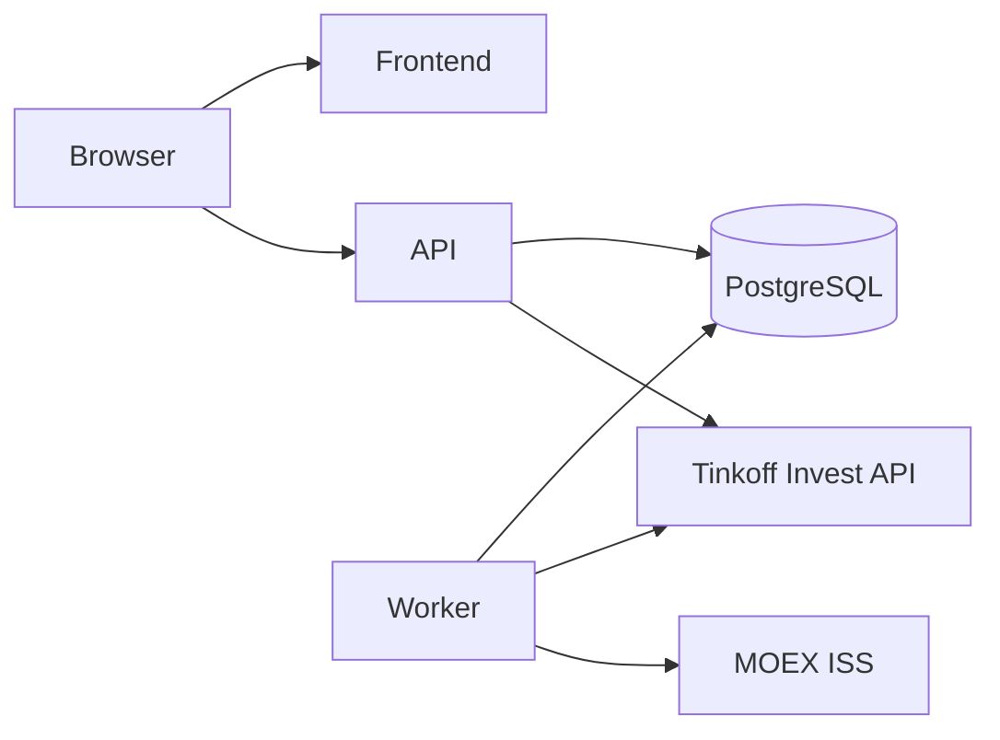
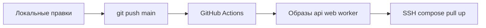

# Личный учёт портфеля (аналог Snowball Income)

## Как реализуем: по блокам

План уже режется на вертикальные блоки. Так и будем делать: **один блок за подход**, затем стоп и проверка, что сервис поднимается в Docker. Следующий блок — только после вашего «дальше».

Так удобнее и вам, и агенту: меньше расползания контекста, каждый блок сам по себе запускаемый, проще откатить и ревьюить. Весь v1 одной сессией не тащим.

Порядок блоков ниже. Блок 0 и 0b можно сделать подряд в первом заходе (каркас без них бесполезен).

## Решение по стеку

**Бэкенд нужен.** Без него нельзя безопасно хранить токен Т‑Банка, тянуть сделки по API, считать XIRR, строить историю стоимости и обновлять цены по расписанию.

- **Backend:** Python 3.12, FastAPI, SQLAlchemy 2 (async), Alembic, Pydantic v2, SDK `tinkoff-investments`
- **Worker:** отдельный процесс с APScheduler (синк, котировки, календарь). Redis/Celery для одного пользователя не нужны
- **БД:** PostgreSQL 16 в Docker
- **Frontend:** React + Vite + TypeScript, Tailwind, TanStack Query/Table, графики (Recharts + lightweight-charts)
- **Упаковка:** Docker Compose. Локально — сборка из исходников; на VDS — готовые образы из registry
- **CI/CD:** GitHub Actions + GHCR. Пуш в `main` собирает образы и обновляет релиз на VDS по SSH (`compose pull && up -d` + миграции)
- **Авторизация:** один пользователь, пароль (bcrypt) + httpOnly-сессия. Токен Invest API шифруется at rest (Fernet), во фронт не отдаётся

Вне скоупа этой работы: Caddy/nginx, сертификаты, файрвол, бэкапы диска VDS. На сервере вы сами повесите прокси на порты compose. Мы отдаём только сервисы приложения.

Почему Python, а не Next.js-only: официальный SDK Т‑Банка, удобный разбор операций, pandas/numpy для XIRR и реконструкции портфеля по дням, проще потом добавить Excel-отчёт.

Имя репозитория по умолчанию: **`portfel`**. Каталог: `~/Projects/portfel` (если `Projects` нет — создадим). Перед любой реализацией агент переедет в этот корень через `move_agent_to_root`.

## Что строим в v1 (и что нет)

Входит в первую версию:

- Один пользователь, несколько счетов Т‑Банка внутри одного портфеля (ИИС + брокерский)
- Синхронизация операций и позиций по **Invest API** (read-only токен)
- Акции, облигации, ETF/БПИФ, валюта/кэш. Базовая валюта — RUB
- Дашборд: стоимость, вложено, прибыль, XIRR, прогноз пассивного дохода
- Таблица активов (кол-во, средняя, текущая цена, P&L, доля)
- Категории с целевыми долями и факт vs план
- Календарь дивидендов и купонов (факт + ближайший прогноз)
- График стоимости портфеля во времени + сравнение с IMOEX (если успеем в блоке 5)

Не входит в v1:

- 20 брокеров, крипта, произвольные активы, look-through фондов
- Налоговый отчёт 3-НДФЛ, рейтинг дивидендов, бэктесты
- Авторебаланс с рекомендациями покупок/продаж
- Настройка самого VDS (прокси, HTTPS, бэкапы хоста)
- Excel-импорт отчёта Т‑Банка — **фаза 2**, если API не отдаст всю историю

## Архитектура сервиса



Три контейнера приложения + Postgres: `frontend` (nginx со статикой Vite), `api` (FastAPI), `worker` (APScheduler), `db`. Фронт ходит на `/api` (в проде это ваш будущий прокси; в compose — сеть Docker).

Поток данных:

1. В настройках сохраняется read-only токен → шифруется в БД
2. Синк (ручной или по расписанию 2 раза в день): счета → операции → инструменты → текущие позиции
3. Котировки: живые из API; дневные закрытия — MOEX ISS по ISIN/тикеру, для иностранных бумаг — свечи Т‑Банка
4. После синка пересчитываются позиции, снимки стоимости по дням, XIRR, ближайшие выплаты

## Docker и CI/CD

Локально: правите код → `docker compose up --build` (или api/frontend без Docker, если так быстрее). Postgres всегда в Compose.

Релизный контур:



- `docker-compose.yml` — разработка: build-контексты, проброс портов, `.env`
- `docker-compose.prod.yml` — релиз: `image: ghcr.io/<user>/portfel-*`, `restart: unless-stopped`, том Postgres, без монтирования исходников
- CI на PR: линт/тесты бэкенда, `npm build` фронта
- CD на пуш в `main`: сборка и пуш образов (тег `sha` + `latest`), затем SSH на VDS: pull, up, `alembic upgrade head`
- Секреты в GitHub: `VDS_HOST`, `VDS_USER`, `VDS_SSH_KEY`. Реестр — `GITHUB_TOKEN` + GHCR

На VDS от вас позже: клон/копия prod-compose, `.env` с паролями, чтобы pipeline мог делать `compose pull`. Прокси и DNS не делаем.

## Модель данных (ядро)

- `users` — логин, хеш пароля
- `broker_connections` — зашифрованный токен, статус синка
- `accounts` — id счёта Т‑Банка, тип (broker/iis)
- `instruments` — figi, ticker, isin, тип, валюта, лотность
- `operations` — сырой журнал (покупка/продажа, дивиденд, купон, налог, комиссия, ввод/вывод). Идемпотентность по `broker_operation_id`
- `positions` — кэш текущих позиций (кол-во, средняя, валюта)
- `prices_daily` — дата, инструмент, close, источник
- `portfolio_snapshots` — дневная стоимость портфеля и кэша в RUB
- `categories` — дерево папок, целевая доля
- `holdings_categories` — привязка инструмента к категории
- `accruals` — дивиденды/купоны: дата, сумма, статус (получено / объявлено / прогноз)
- `sync_runs` — лог синка и ошибки

Расчёт позиций для истории — из `operations` (средняя по оставшимся лотам). Текущий срез сверяется с `GetPortfolio` / `GetPositions` Т‑Банка; расхождения в логе синка, журнал операций молча не затираем.

Метрики:

- **Стоимость** = позиции × цена + свободный кэш
- **Вложено** = себестоимость оставшихся бумаг + кэш
- **Прибыль** = стоимость − чистые вводы + выводы; сверка с суммой нереализ./реализ. P&L + дивиденды/купоны − комиссии − налоги
- **Доходность** = XIRR по вводам/выводам и текущей стоимости
- **Пассивный доход** = прогноз дивидендов/купонов на 12 месяцев / стоимость бумаг

## Структура репозитория

```
portfel/
  backend/
    app/api/
    app/models/
    app/services/
    app/worker.py
    alembic/
    Dockerfile
  frontend/
    src/pages/
    src/api/
    Dockerfile
  .github/workflows/ci.yml
  .github/workflows/release.yml
  docker-compose.yml
  docker-compose.prod.yml
  .env.example
```

## Блоки реализации

**Блок 0 — каркас.** Git, Compose local+prod, FastAPI+React, логин одним пользователем из `.env`, healthcheck, миграции. Сервис открывается локально в браузере.

**Блок 0b — CI/CD.** Workflows: проверка PR, публикация образов в GHCR, деплой по SSH. Короткий README: какие секреты выставить и что должно лежать на VDS (compose.prod + `.env`), без настройки прокси.

**Блок 1 — синхронизация Т‑Банка.** Сохранение токена, счета, операции через `OperationsService`, инструменты, текущие позиции, кнопка «Обновить», лог `sync_runs`.

**Блок 2 — дашборд и активы.** Позиции из операций, живые цены, таблица, карточки стоимость/вложено/прибыль, кэш как позиция.

**Блок 3 — категории.** CRUD дерева, назначение бумаг, целевые доли, факт vs план.

**Блок 4 — календарь.** Факт из `DIVIDEND`/`COUPON`; прогноз `GetDividends` + `GetBondCoupons`; месяц и сумма на 12 месяцев.

**Блок 5 — аналитика.** XIRR, `portfolio_snapshots`, график стоимости, опционально IMOEX.

Excel-отчёт Т‑Банка — отдельная фаза после стабильного API.

## Риски

- Invest API может не отдать операции за все годы — в UI честная «история с даты X»
- Облигации: в v1 купоны и рыночная цена, полный НКД-P&L упрощён
- Валютная переоценка агрегатов в RUB на дату
- Токен не в git и не в логах; том Postgres только в Docker volume

## Критерий готовности v1

Локально в Docker после вставки read-only токена сервис подтягивает счета, показывает портфель, считает прибыль и XIRR, даёт категории, календарь и график стоимости. Пуш в `main` собирает образы и обновляет контейнеры на VDS (когда вы пропишете SSH-секреты и prod-compose). Прокси/HTTPS на сервере — на вашей стороне.
